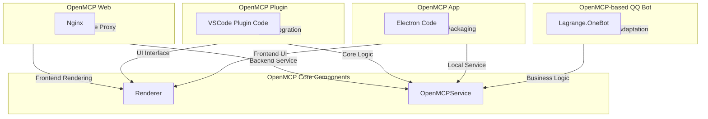

<div align="center">


<h3>OpenMCP: All you need for MCP Development</h3>

English | [中文](./README.zh.md)

<a href="https://openmcp.kirigaya.cn" target="_blank" style="display: inline-block; padding: 8px 16px; background-color: rgb(84, 176, 84); color: white; border-radius: .5em; text-decoration: none;">🫱 Official Documentation</a>

<a href="https://qm.qq.com/cgi-bin/qm/qr?k=C6ZUTZvfqWoI12lWe7L93cWa1hUsuVT0&jump_from=webapi&authKey=McW6B1ogTPjPDrCyGttS890tMZGQ1KB3QLuG4aqVNRaYp4vlTSgf2c6dMcNjMuBD" target="_blank" style="display: inline-block; padding: 8px 16px; background-color: #CB81DA; color: white; border-radius: .5em; text-decoration: none;">OpenMCP QQ Group</a>

<a href="https://discord.gg/SKTZRf6NzU" target="_blank" style="display: inline-block; padding: 8px 16px; background-color: rgb(84, 176, 84); color: white; border-radius: .5em; text-decoration: none;">OpenMCP Discord Channel</a>

</div>

## OpenMCP

An all-in-one vscode/trae/cursor plugin for MCP server debugging.

[](https://www.youtube.com/watch?v=S7igsEhcLiw)
### [👆 Full Video](https://www.youtube.com/watch?v=S7igsEhcLiw)

### openmcp-client

Integrated Inspector + MCP client basic functions, combining development and testing into one.


Test mcp tools, prompts and resources with a variety of tools.


Tested tools can be placed in the "Interactive Testing" module for large model interaction testing.


Complete project-level management panel for easier MCP project management at both project and global levels.


Supports multiple large models


Support XML mode and customized options for your tool selection.


### openmcp-sdk

once everything is tested and verified in `openmcp-client`, you can deploy your mcp as an agent app with `openmcp-sdk` fastly and easily:

```bash
npm install openmcp-sdk
```

then deploy your agent with just lines of codes

```typescript
import { OmAgent } from 'openmcp-sdk/service/sdk';

// create Agent
const agent = new OmAgent();
    
// Load configuration, which can be automatically generated after debugging with openmcp client
agent.loadMcpConfig('./mcpconfig.json');

// Read the debugged prompt
const prompt = await agent.getPrompt('hacknews', { topn: '5' });    

// Execute the task
const res = await agent.ainvoke({ messages: prompt });

console.log('⚙️ Agent Response', res);
```

output

```
[2025/6/20 20:47:31] 🚀 [crawl4ai-mcp] 1.9.1 connected
[2025/6/20 20:47:35] 🤖 Agent wants to use these tools get_web_markdown
[2025/6/20 20:47:35] 🔧 using tool get_web_markdown
[2025/6/20 20:47:39] ✓  use tools success
[2025/6/20 20:47:46] 🤖 Agent wants to use these tools get_web_markdown, get_web_markdown, get_web_markdown
[2025/6/20 20:47:46] 🔧 using tool get_web_markdown
[2025/6/20 20:47:48] ✓  use tools success
[2025/6/20 20:47:48] 🔧 using tool get_web_markdown
[2025/6/20 20:47:54] ✓  use tools success
[2025/6/20 20:47:54] 🔧 using tool get_web_markdown
[2025/6/20 20:47:57] ✓  use tools success

⚙️ Agent Response
⌨️ Today's Tech Article Roundup

📌 How to Detect or Observe Passing Gravitational Waves?
Summary: This article explores the physics of gravitational waves, explaining their effects on space-time and how humans might perceive or observe this cosmic phenomenon.
Author: ynoxinul
Posted: 2 hours ago
Link: https://physics.stackexchange.com/questions/338912/how-would-a-passing-gravitational-wave-look-or-feel

📌 Learn Makefile Tutorial
Summary: A comprehensive Makefile tutorial for beginners and advanced users, covering basic syntax, variables, automatic rules, and advanced features to help developers manage project builds efficiently.
Author: dsego
Posted: 4 hours ago
Link: https://makefiletutorial.com/

📌 Hurl: Run and Test HTTP Requests in Plain Text
Summary: Hurl is a command-line tool that allows defining and executing HTTP requests in plain text format, ideal for data fetching and HTTP session testing. It supports chained requests, value capture, and response queries, making it perfect for testing REST, SOAP, and GraphQL APIs.
Author: flykespice
Posted: 8 hours ago
Link: https://github.com/Orange-OpenSource/hurl
```

[🔗 Document of openmcp-sdk](https://openmcp.kirigaya.cn/sdk-tutorial/)


## Want to become a contributor ?

Click [here](https://openmcp.kirigaya.cn/preview/join.html) to learn how to make contribution to OpenMCP.

## Join Our Community

* Email: **zhelonghuang@qq.com**
* QQ: 782833642
* Wechat: contact `lstmkirigaya`
* Discord: https://discord.gg/SKTZRf6NzU


## TODO

## Feature Roadmap

| Module | Feature | Priority | Status | Fix Priority |
|---------|---------|--------|---------|-----------|
| `all` | Complete basic infrastructure | `Full Version` | 100% | `Done` |
| `render` | Support cost analysis in chat mode | `Iteration` | 100% | `Done` |
| `ext` | Support basic MCP project management | `Iteration` | 100% | `P0` |
| `service` | Support custom OpenAI-compatible large model integration | `Full Version` | 100% | `Done` |
| `service` | Support custom protocol large model integration | `MVP` | 0% | `P1` |
| `all` | Support debugging multiple MCP Servers simultaneously | `MVP` | 100% | `P0` |
| `all` | Support online verification via large models | `Iteration` | 100% | `Done` |
| `all` | Support saving user's server debugging work | `Iteration` | 100% | `Done` |
| `render` | High-risk operation permission confirmation | `MVP` | 0% | `P1` |
| `service` | Hot update for connected MCP servers | `MVP` | 0% | `P1` |
| `service` | Cloud sync for system configuration | `MVP` | 0% | `P1` |
| `all` | System prompt management module | `Iteration` | 100% | `Done` |
| `service` | Tool-wise logging system | `MVP` | 0% | `P1` |
| `service` | MCP security checks (prevent prompt injection, etc.) | `MVP` | 0% | `P1` |
| `service` | Built-in OCR for character recognition | `Iteration` | 100% | `Done` |

## Project Concept

OpenMCP adopts a layered modular design. By assembling different modules, it can be implemented in different modes on different platforms.



## Development
- renderer : Frontend UI definitions
- service : Test components for renderer , including a simple forwarding layer
- src : VSCode plugin definitions

### Renderer & Service Development


Project setup:

```bash
npm run setup
```
Start dev server:

```bash
npm run serve
```

### Extension Development


Build for deployment:

```bash
npm run build
```

build vscode extension:

```bash
npm run build:plugin
```

Then just press F5, いただきます (Let's begin)

---

## CI Pipeline

✅ npm run build
✅ npm run build:task-loop
✅ openmcp-client UT
✅ openmcp-sdk UT
✅ vscode extension UT
