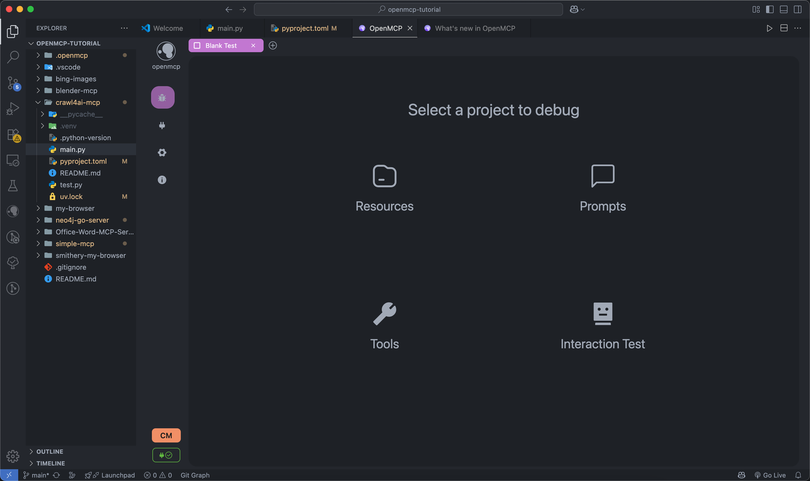
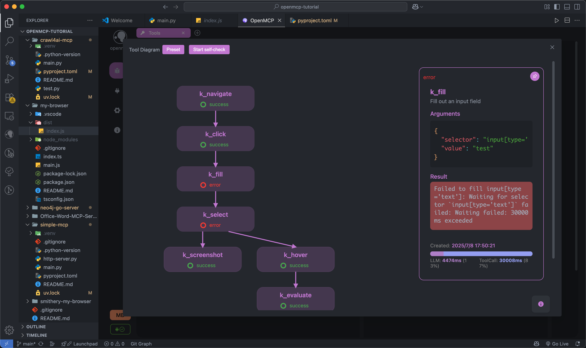
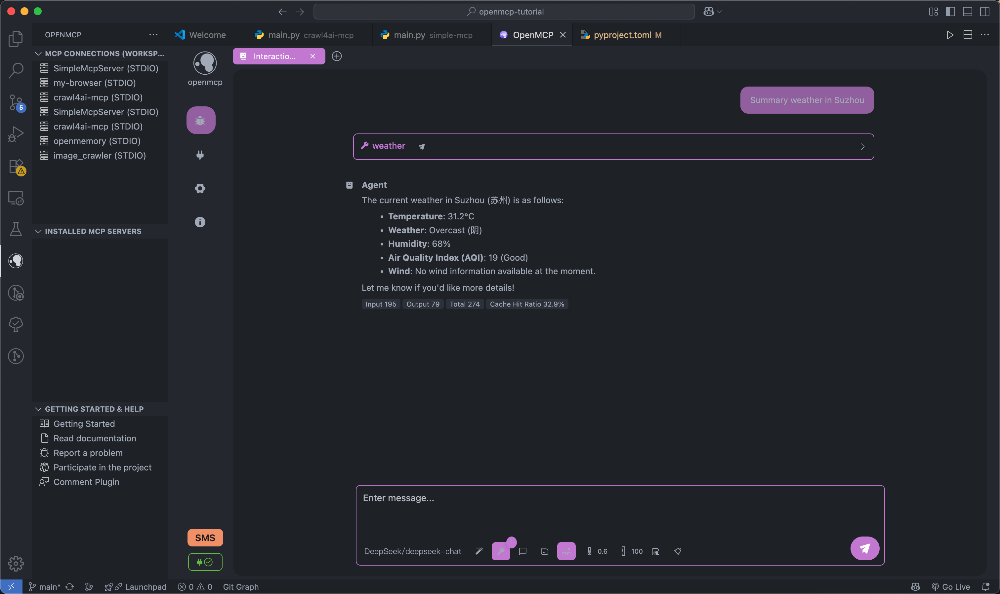
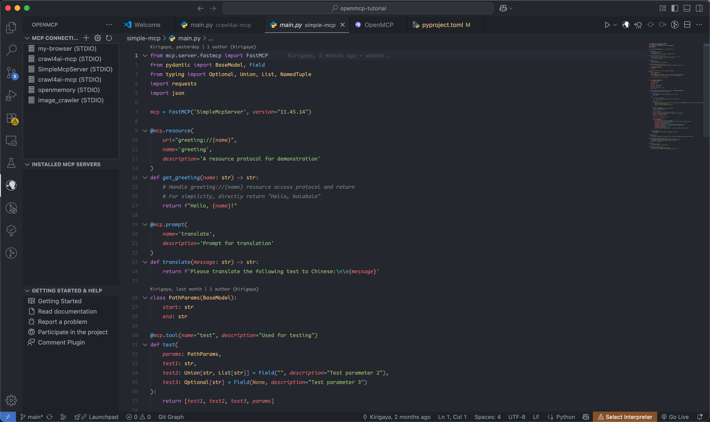
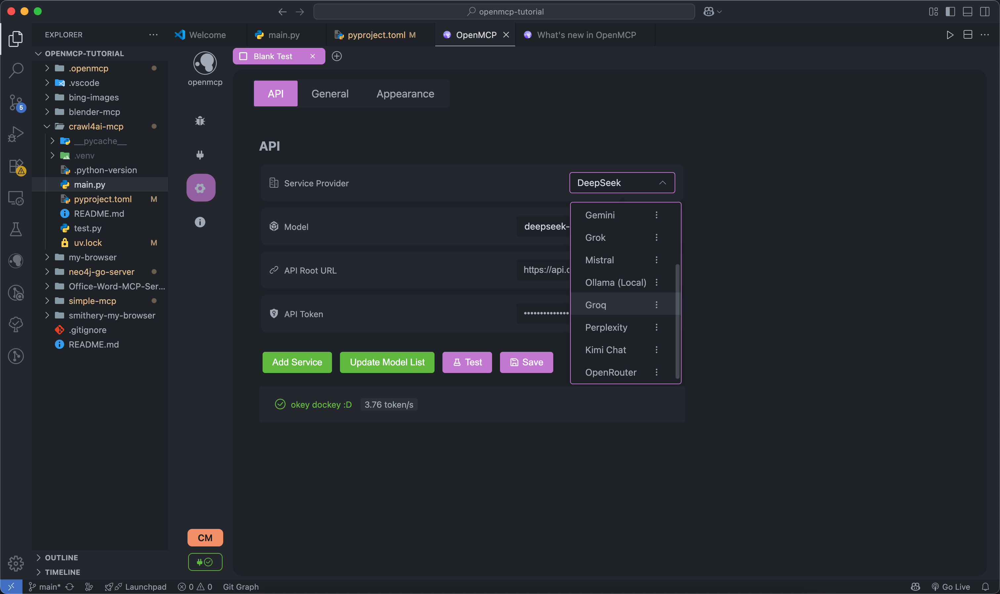
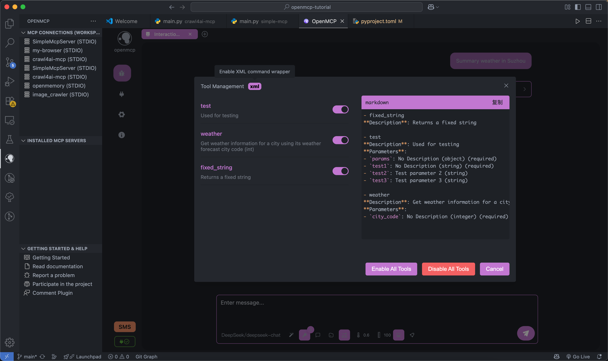
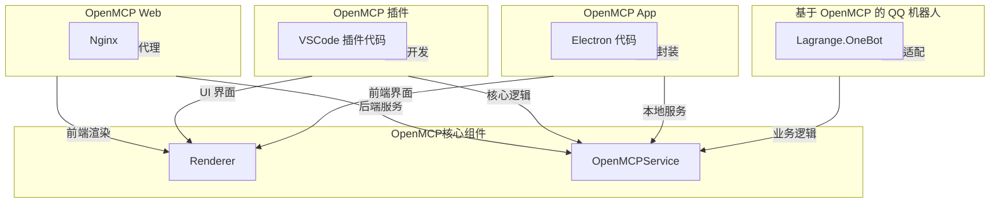
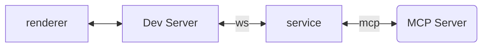
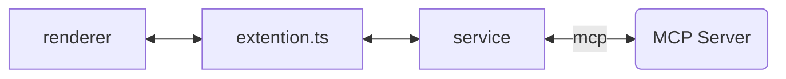

<div align="center">


<h3>OpenMCP: 一体化 MCP Server 调试器</h3>

[English](./README.md) | 中文

<a href="https://openmcp.kirigaya.cn" target="_blank" style="display: inline-block; padding: 8px 16px; background-color: rgb(84, 176, 84); color: white; border-radius: .5em; text-decoration: none;"> 🫱  官方文档</a>

<a href="https://qm.qq.com/cgi-bin/qm/qr?k=C6ZUTZvfqWoI12lWe7L93cWa1hUsuVT0&jump_from=webapi&authKey=McW6B1ogTPjPDrCyGttS890tMZGQ1KB3QLuG4aqVNRaYp4vlTSgf2c6dMcNjMuBD" target="_blank" style="display: inline-block; padding: 8px 16px; background-color: #CB81DA; color: white; border-radius: .5em; text-decoration: none;">OpenMCP QQ 讨论群</a>

<a href="https://discord.gg/SKTZRf6NzU" target="_blank" style="display: inline-block; padding: 8px 16px; background-color: rgb(84, 176, 84); color: white; border-radius: .5em; text-decoration: none;">OpenMCP Discord 频道</a>

</div>

## OpenMCP

一款用于 MCP 服务端调试的一体化 vscode/trae/cursor 插件。

[](https://www.bilibili.com/video/BV1MFTBzpEtZ/?vd_source=3f248073d6ebdb61308992901b606f24)
### [👆 完整视频](https://www.youtube.com/watch?v=S7igsEhcLiw)

### openmcp-client

集成 Inspector + MCP 客户端基础功能，开发测试一体化。



进行资源协议、工具、Prompt 的 MCP 服务器测试。



测试完成的工具可以放入 「交互测试」 模块之间进行大模型交互测试。



完整的项目级管理面板，更加方便的进行项目和全局的 mcp 项目管理。



支持多种大模型



支持 XML 模式和自定义工具选择



### openmcp-sdk

一旦你在 `openmcp-client` 中完成了所有测试和验证，就可以使用 `openmcp-sdk` 快速且轻松地将你的 MCP 部署为一个 Agent 应用：

```bash
npm install openmcp-sdk
```

然后只需几行代码就能部署你的 Agent：

```typescript
import { OmAgent } from 'openmcp-sdk/service/sdk';

// 创建 Agent 实例
const agent = new OmAgent();
    
// 加载配置文件，该文件可在使用 openmcp client 调试后自动生成
agent.loadMcpConfig('./mcpconfig.json');

// 读取调试过的 prompt
const prompt = await agent.getPrompt('hacknews', { topn: '5' });    

// 执行任务
const res = await agent.ainvoke({ messages: prompt });

console.log('⚙️ Agent Response', res);
```

输出

```
[2025/6/20 20:47:31] 🚀 [crawl4ai-mcp] 1.9.1 connected
[2025/6/20 20:47:35] 🤖 Agent wants to use these tools get_web_markdown
[2025/6/20 20:47:35] 🔧 using tool get_web_markdown
[2025/6/20 20:47:39] ✓  use tools success
[2025/6/20 20:47:46] 🤖 Agent wants to use these tools get_web_markdown, get_web_markdown, get_web_markdown
[2025/6/20 20:47:46] 🔧 using tool get_web_markdown
[2025/6/20 20:47:48] ✓  use tools success
[2025/6/20 20:47:48] 🔧 using tool get_web_markdown
[2025/6/20 20:47:54] ✓  use tools success
[2025/6/20 20:47:54] 🔧 using tool get_web_markdown
[2025/6/20 20:47:57] ✓  use tools success

⚙️ Agent Response
⌨️ Today's Tech Article Roundup

📌 How to Detect or Observe Passing Gravitational Waves?
Summary: This article explores the physics of gravitational waves, explaining their effects on space-time and how humans might perceive or observe this cosmic phenomenon.
Author: ynoxinul
Posted: 2 hours ago
Link: https://physics.stackexchange.com/questions/338912/how-would-a-passing-gravitational-wave-look-or-feel

📌 Learn Makefile Tutorial
Summary: A comprehensive Makefile tutorial for beginners and advanced users, covering basic syntax, variables, automatic rules, and advanced features to help developers manage project builds efficiently.
Author: dsego
Posted: 4 hours ago
Link: https://makefiletutorial.com/

📌 Hurl: Run and Test HTTP Requests in Plain Text
Summary: Hurl is a command-line tool that allows defining and executing HTTP requests in plain text format, ideal for data fetching and HTTP session testing. It supports chained requests, value capture, and response queries, making it perfect for testing REST, SOAP, and GraphQL APIs.
Author: flykespice
Posted: 8 hours ago
Link: https://github.com/Orange-OpenSource/hurl
```

[🔗 openmcp-sdk 文档](https://openmcp.kirigaya.cn/sdk-tutorial/)

## 想要成为贡献者？

点击 [这里](https://openmcp.kirigaya.cn/preview/join.html) 了解如何为 OpenMCP 做出贡献。

## 加入我们的社区

* 邮箱: **zhelonghuang@qq.com**
* QQ 群：782833642
* 微信：联系 `lstmkirigaya`
* Discord：[https://discord.gg/SKTZRf6NzU](https://discord.gg/SKTZRf6NzU)

## TODO

## 需求规划

| 所在模块 | 需求内容 | 功能优先级 | 当前状态 | 修复优先级 |
|---------|---------|--------|---------|-----------|
| `all` | 完成最基本的各类基础设施 | `完整版本` | 100% | `Done` |
| `render` | chat 模式下支持进行成本分析 | `迭代版本` | 100% | `Done` |
| `ext` | 支持基本的 MCP 项目管理 | `迭代版本` | 100% | `P0` |
| `service` | 支持自定义支持 openai 接口协议的大模型接入 | `完整版本` | 100% | `Done` |
| `service` | 支持自定义接口协议的大模型接入 | `MVP` | 0% | `P1` |
| `all` | 支持同时调试多个 MCP Server | `MVP` | 100% | `P0` |
| `all` | 支持通过大模型进行在线验证 | `迭代版本` | 100% | `Done` |
| `all` | 支持对用户对应服务器的调试工作内容进行保存 | `迭代版本` | 100% | `Done` |
| `render` | 高危操作权限确认 | `MVP` | 0% | `P1` |
| `service` | 对于连接的 mcp server 进行热更新 | `MVP` | 0% | `P1` |
| `service` | 系统配置信息云同步 | `MVP` | 0% | `P1` |
| `all` | 系统提示词管理模块 | `迭代版本` | 100% | `Done` |
| `service` | 工具 wise 的日志系统 | `MVP` | 0% | `P1` |
| `service` | 自带 OCR 进行字符识别 | `迭代版本` | 100% | `Done` |


## 项目概念

openmcp 采用分层模块化设计，通过组装不同的模块，可以将它实现成不同平台上的不同模式。




---

## Dev

- `renderer`: 前端 UI 的定义
- `service`: 测试 `renderer` 的部分，包含一个简易的转发层
- `src`: vscode 插件端定义

### Renderer & Service Dev



配置项目

```bash
npm run setup
```

启动 dev server

```bash
npm run dev
```

> 端口占用： 8282 (renderer) + 8081 (service)

### Extention Dev



负载部署
```bash
npm run build
```

and just press f5, いただきます
