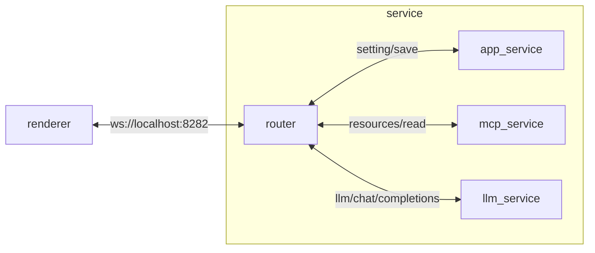
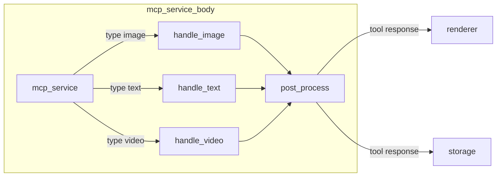
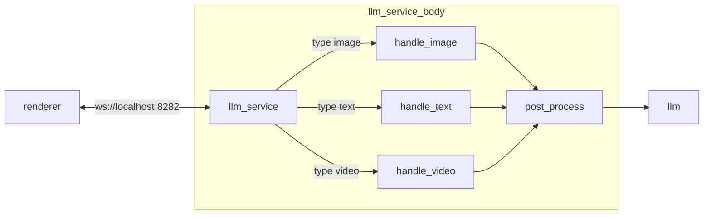

## Arch

```mermaid
graph LR

renderer <--ws://localhost:8282--> router
subgraph service
    router <--setting/save--> app_service
    router <--resources/read--> mcp_service
    router <--llm/chat/completions--> llm_service
end
```

## Detail

Simplify via decorator

### mcp to renderer

```mermaid
graph LR

subgraph mcp_service_body
    mcp_service --type image --> handle_image
    mcp_service --type text --> handle_text
    mcp_service --type video --> handle_video
    handle_image --> post_process
    handle_text --> post_process
    handle_video --> post_process
end

post_process --tool response--> renderer
post_process --tool response--> storage
```

### service to llm

```mermaid
graph LR

renderer <--ws://localhost:8282--> llm_service
subgraph llm_service_body
    llm_service --type image --> handle_image
    llm_service --type text --> handle_text
    llm_service --type video --> handle_video
    handle_image --> post_process
    handle_text --> post_process
    handle_video --> post_process
end

post_process --> llm
```